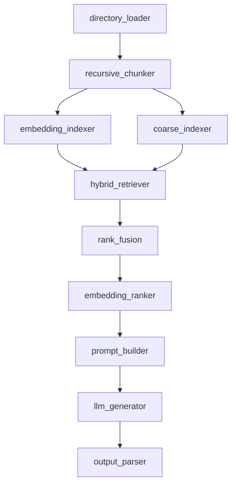

# Modular RAG

This is my personal modular RAG playground. I use it to iterate on pipeline design quickly without rewriting the whole app each time.

The repo is config-driven: I define steps in YAML, and `pipeline/registry.py` wires those steps to actual components.

## Current Scope (What Actually Works Today)

As of now, the **main maintained path is `custom` pipeline**.

### `custom` pipeline flow



### What this means in practice

- ingestion: directory-based loading works
- chunking: recursive chunking works
- indexing: both embedding + coarse lexical index are built in init phase
- retrieval: hybrid retriever pulls from dense (`fine_retriever`) + sparse (`coarse_retriever`)
- fusion: `rank_fusion` currently combines result lists (not weighted RRF yet)
- ranking: `embedding_ranker` is used in `custom.yaml`
- generation: prompt template + LLM call + Pydantic parse works

## Run

```bash
python3 cli.py --pipeline custom --runtime cli --env dev
```

Current CLI behavior:

- query is hardcoded in `cli.py`
- source path is hardcoded in `cli.py`
- output prints `state["parsed_output"].answer`

## Config Notes

### Base config

`configs/base.yaml` currently includes:

- LLM: Ollama (`llama3.2:latest`)
- embeddings: Ollama (`qwen3-embedding:4b`)
- retrieval:
  - `top_k: 20`
  - `hybrid.candidate_multiplier: 4`
- ranking:
  - `top_k: 5`
  - `embedding_model_name`
  - `cross_encoder_model_name`

### Orchestrator feature

`pipeline/orchestrator.py` supports:

- `component: string`
- `component: [list, of, components]`

So I can run one step name with multiple components (used for dual indexers in `custom.yaml`).

## Component Status

### Implemented and usable

- Ingestion:
  - `DirectoryLoader`, `DocumentLoader`, `MarkdownLoader`, `TextLoader`, `SourceNormalizer`
- Chunking:
  - `RecursiveChunker`, `SemanticChunker`
- Indexing:
  - `EmbeddingIndexer`, `CoarseIndexer`
- Retrieval:
  - `CoarseRetriever` (BM25 scoring)
  - `FineRetriever` (vector similarity)
  - `HybridRetriever` (collects dense + sparse candidates)
- Context:
  - `ContextBuilder`, `ContextMerger`, `ContextTruncator`
- Ranking:
  - `EmbeddingRanker`
  - `CrossEncoderRanker` (wired and available)
  - `RankFusion` (currently basic list fusion)
- Generation:
  - `PromptBuilder`, `Generator`, `OutputParser`
- Postprocessing:
  - `AnswerCleaner`, `Refiner`, `SelfCritic` (simple baseline behavior)

### Present but not implemented yet (`raise NotImplementedError`)

- `LateChunker`
- `StreamingGenerator`
- `ExternalRetriever`, `GraphRetriever`, `MemoryRetriever`
- `ColBERTRanker`
- evaluation adapters:
  - `Evaluator`, `RagasEvaluator`, `TruLensEvaluator`
- `LocalVectorDB`
- FAISS append path in `LangChainFAISSStore.add_documents` when index already exists

## Important Known Limitations

1. `pipeline/registry.py` currently chunks with `chunk_inputs[1:]`.
- This skips the first extracted input and is marked FIXME.

2. `rank_fusion` is basic.
- Right now it combines result sets; it does not yet do weighted RRF scoring.

3. Some pipeline YAMLs are stale compared to registry wiring.
- `custom.yaml` is the one I actively keep aligned.

4. CLI is not interactive yet.
- Query/source overrides are still hardcoded in code.

## Project Structure

```text
rag/
├── components/
│   ├── chunking/
│   ├── context/
│   ├── evaluation/
│   ├── generation/
│   ├── indexer/
│   ├── ingestion/
│   ├── memory/
│   ├── postprocessing/
│   ├── query/
│   ├── ranking/
│   └── retrieval/
├── configs/
│   ├── base.yaml
│   ├── env/
│   ├── pipeline/
│   └── runtime/
├── infra/
├── pipeline/
├── cli.py
└── README.md
```

## Setup

```bash
cd /Users/nidhishkumar/Personal/rag
python3 -m venv .venv
source .venv/bin/activate
pip install -r requirements.txt
```

If BM25 is missing locally:

```bash
pip install rank_bm25
```

## What I’d Build Next

- weighted RRF in `RankFusion`
- interactive CLI inputs (query, source, top_k, template)
- remove the `chunk_inputs[1:]` workaround
- normalize older pipeline YAMLs so they match registry keys
- finish streaming + evaluation adapters
